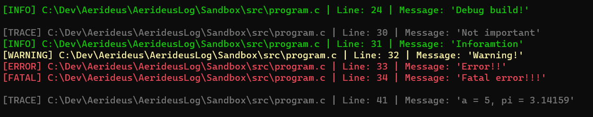

# Aerideus Log

Aerideus Log is a lightweight and easy to use library for console and file logging. All logging can be done for a specific build type to allow debug messages with no impact on performance when the project is built to be released, without having to change any code. Additionally, the logs include extra information about the severity of the message, where the message was sent from and with different colors to improve readability.

<br>

## Getting started

Aerideus Log is very easy to set up and use.

1. Clone the main branch of the repository for the latest stable version.
2. Run the `Premake5` file for your preferred IDE. The included *.bat* file can be used for `Windows` and `Visual Studio 2022`.
3. Run the demo program to see if everything is working as intended. The `Sandbox` project conitain some example code to demonstrate features of the library.
4. The library can be compiled and linked into any project together with the `include` directory in `AeridesLog`. Alternatively, modify the `Premake5` file to create and link your own project.

Aerideus Log can be used in any project, free of charge, as long as the required files are included. For more information about use and warranty, see license file.

<br>

---

## General

Aerideus Log is a logging library in C to simplify application development. Messages can be logged to the console or a log file with information about importance, what file and line it came from and with colors to make differentiating between different types of messages easier. Below is a screenshot of the console output from a simple program:



<br>

---

## Preprocessor definitions

For the library to work as intended, there are several preprocessor definitions that are defined in the `premake5.lua` file. They specify the build configuration and platform. If you choose to write your own `Premake5` file or use a different tool to build project files, the following preprocessor definitions must be defined.

| Preprocessor definition | Build type |
| ----------------------- | ---------- |
| AE_DEBUG                | Debug build |
| AE_RELEASE              | Release build |
| AE_DIST                 | Distribution build |

| Preprocessor definition | Platform |
| ----------------------- | -------- |
| AE_WINDOWS              | Windows  |
| AE_MACOS                | MacOS    |
| AE_LINUX                | Linux    |

<br>

## Severity levels

Aerideus Log has *5* severity levels that are specified through an `enum` called `log_level`. The 5 levels are `TRACE`, `INFO`, `WARNING`, `ERROR` and `FATAL`. How these levels are intended to be used can be found in the table below:

| Severity level | Purpose |
| -------------- | ------- |
| TRACE          | Information of low importance |
| INFO           | Information of high importance |
| WARNING        | Problems of low importance |
| ERROR          | Problems of high importance |
| FATAL          | Problems that requires termination |

*Thresholds* for both console and file logging can be set at *any point* during the runtime. The defult threshold is `TRACE` for both console and file logging, meaning that all severity levels will be printed. An exemple of how the threshold is set can be found below:

```c
// Sets the threshold for console logging to INFO, meaning that everything except TRACE messages will be printed.
AE_LOG_CONSOLE_LEVEL_SET(INFO);

// Sets the threshold for file logging to WARNING, meaning that everything except TRACE and INFO messages will be printed.
AE_LOG_FILE_LEVEL_SET(WARNING);
```

<br>

---

## Console logging

All console logging is done through *macros* of the format `AE_LOG_CONSOLE_[Build Type]_[Severity](const char* message)`. *Build type* refers to the build type that must currently be selected for the logging to be performed. *Severity refers to the desired severity that the message should be logged with.

The *build type* and *severity level* can be omitted. In cases where the severity level is omitted, it must instead be specified as an argument and the format of the macros is then `AE_LOG_CONSOLE_[Build Type](log_level level, const char* message)`. In cases where the build type is omitted, the logging will be done regardless of the current build type and the format is then `AE_LOG_CONSOLE_[Severity](const char* message)`.

To make the console output more readable, a blank line can be logged at any point. This can be done through *macros* of the format `AE_LOG_CONSOLE_NEXT_LINE_[Build Type]()`. *Build type* refers to the build type that must currently be selected for the blank line to be inserted. The *build type* can be omitted and the macro is then `AE_LOG_CONSOLE_NEXT_LINE()`.

### Console examples

```c
// Logs "Information" to the console with severity level INFO, regardless of build type. 
AE_LOG_CONSOLE(INFO, "Information");

// Logs "Information" to the console with severity level INFO, only if the current build type is Debug. 
AE_LOG_CONSOLE_DEBUG(INFO, "Information");

// Logs "Information" to the console with severity level INFO, regardless of build type. 
AE_LOG_CONSOLE_INFO("Information");

// Logs "Information" to the console with severity level INFO, only if the current build type is Debug. 
AE_LOG_CONSOLE_DEBUG_INFO("Information");

// Logs a blank line to the console regardless of build type.
AE_LOG_CONSOLE_NEXT_LINE();

// Logs a blank line to the console only if the current build type is Debug.
AE_LOG_CONSOLE_NEXT_LINE_DEBUG();
```

<br>

---

## File logging

All file logging is done through *macros* of the format `AE_LOG_FILE_[Build Type]_[Severity](const char* message)`. *Build type* refers to the build type that must currently be selected for the logging to be performed. *Severity* refers to the desired severity that the message should be logged with.

The *build type* and *severity level* can be omitted. In cases where the severity level is omitted, it must instead be specified as an argument and the format of the macros is then `AE_LOG_FILE_[Build Type](log_level level, const char* message)`. In cases where the build type is omitted, the logging will be done regardless of the current build type and the format is then `AE_LOG_FILE_[Severity](const char* message)`.

To make the log file more readable, a blank line can be logged at any point. This can be done through *macros* of the format `AE_LOG_FILE_NEXT_LINE_[Build Type]()`. *Build type* refers to the build type that must currently be selected for the blank line to be inserted. The *build type* can be omitted and the macro is then `AE_LOG_FILE_NEXT_LINE()`.

### File examples

```c
// Logs "Information" to the log file with severity level INFO, regardless of build type. 
AE_LOG_FILE(INFO, "Information");

// Logs "Information" to the log file with severity level INFO, only if the current build type is Debug. 
AE_LOG_FILE_DEBUG(INFO, "Information");

// Logs "Information" to the log file with severity level INFO, regardless of build type. 
AE_LOG_FILE_INFO("Information");

// Logs "Information" to the log file with severity level INFO, only if the current build type is Debug. 
AE_LOG_FILE_DEBUG_INFO("Information");

// Logs a blank line to the log file regardless of build type.
AE_LOG_FILE_NEXT_LINE();

// Logs a blank line to the log file only if the current build type is Debug.
AE_LOG_FILE_NEXT_LINE_DEBUG();
```

### Exporting

The log file must be exported before termination. This is done through the macro `AE_LOG_FILE_EXPORT(const char* path)` and should be done only once, at the very end of excecution. It is recommended to use a file path that ends with *.txt*, and this must be specified by the user. *No file is created* if the log file is empty when the file is exported or if the path is invalid.

### Export example

```c
// Exports the log file to the specified path and frees allocated memory.
AE_LOG_FILE_EXPORT("path.txt");
```

<br>

---

Last modified: 2023-03-21

Copyright (c) 2023 Aerideus
